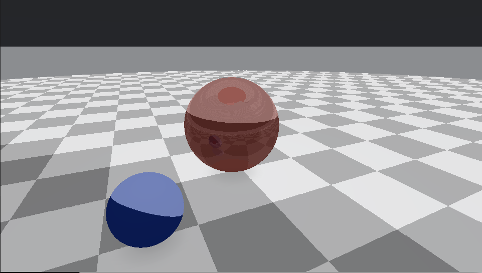
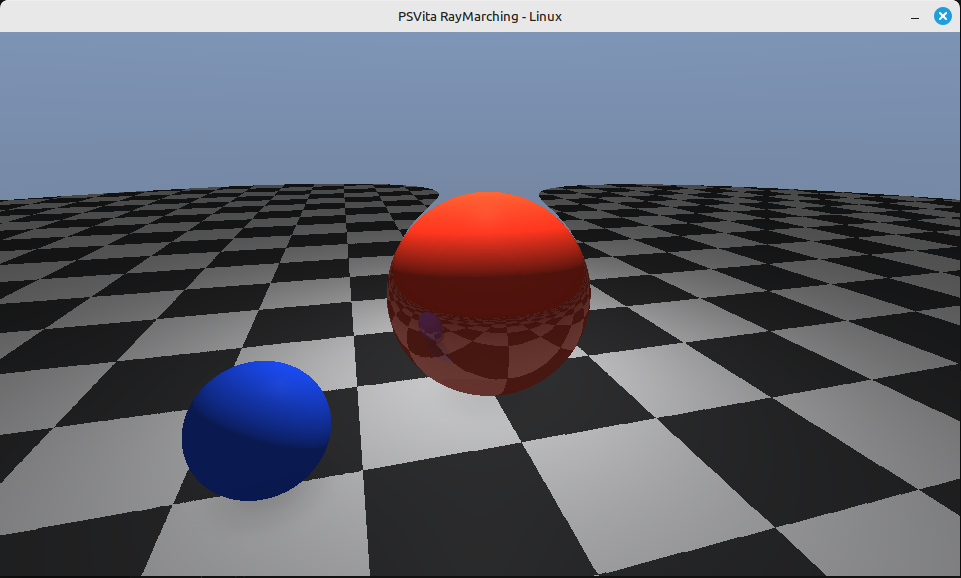

# PSVita Raymarching Demo

A cool raymarching demo that runs on both PS Vita and Linux! Features some nice PBR shading and reflections.

## What's This?

Basically, it's a real-time rendered scene using raymarching (no polygons!) with:
- A shiny red ball that reflects stuff
- A blue matte ball that doesn't reflect
- Both balls sitting on a gray plane
- The red ball bounces around in a figure-8 pattern
- Proper PBR materials and lighting


## What You'll See

The scene is pretty simple but looks good:
- Gray ground plane
- Red metallic sphere (shiny, moves around, has reflections)
- Blue diffuse sphere (matte, stays put)
- Nice sky gradient background
- Dynamic lighting

## Building and Running

### Linux
First, install the dependencies:
```bash
sudo apt-get install libglfw3-dev libglew-dev libpng-dev libgl1-mesa-dev
```

Then build and run:
```bash
make linux
./build_linux/raymarch
```

**Controls:** Move mouse to look around, ESC to quit.

### PS Vita
You'll need VitaSDK installed. Then:
```bash
make vita
```

Install the `build/raymarch.vpk` on your Vita and run it.

**Controls:** Left stick to move camera, START to quit.

## How It Works

The magic happens in the shaders. Each platform uses different shader languages:
- **PS Vita**: CG shaders (`raymarch.vert`/`raymarch.frag`)
- **Linux**: GLSL shaders (`raymarch_glsl.vert`/`raymarch_glsl.frag`)

But they do the same thing - raymarching with PBR lighting. No meshes, just math!

**Note:** The shaders look a bit different between platforms due to PS Vita's hardware limitations. The Vita version has reduced raymarching iterations, simplified effects, and some optimizations to run smoothly on the mobile GPU. But the core rendering and visual result should be very similar!

## Screenshots

### PS Vita


### Linux


## Troubleshooting

**Can't build?** Make sure you have all the dependencies installed and VitaSDK set up properly for Vita builds.
